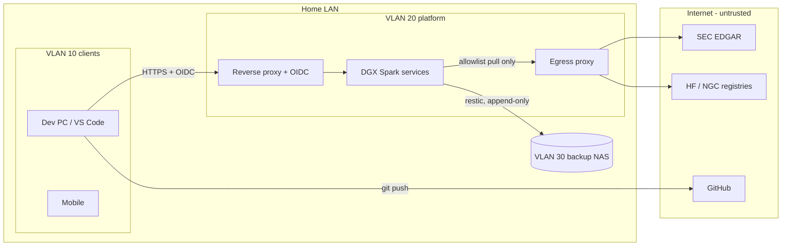

# 02 — Threat Model (STRIDE-lite)

## Assets
A1 proprietary research & prompts · A2 derived datasets/signals · A3 source code · A4 credentials · A5 model weights (integrity)

## Trust boundaries

## Threats & controls
| # | Threat | STRIDE | Control | ADR |
|---|---|---|---|---|
| T1 | Prompt/data exfiltration via an agent tool making outbound HTTP | I | Default-deny egress on VLAN 20; agents have no web tool at all in v1 (no `fetch` MCP server) | 0012, 0008 |
| T2 | Prompt injection in filings/web content causes destructive tool calls | T/E | MCP read-only by default; write tools require human confirmation; tool allowlist per agent | 0008 |
| T3 | Malicious/compromised model weights or pickle payloads | T | safetensors only; pin revision SHA; checksum verify; no `trust_remote_code` unless reviewed | 0006 |
| T4 | Supply chain in containers / Python / NuGet | T | Pinned digests and SHAs, lockfiles, Grype scan in CI, Dependabot PRs; agents cannot add packages | 0005, 0016 |
| T5 | Secret leakage to GitHub | I | Secrets never in git (manifest only), gitleaks pre-commit + CI, runner without cloud creds | 0004, 0010 |
| T6 | Strangers' PRs run code via CI (public repo) | E | No self-hosted runner; GitHub-hosted runners only; fork-PR workflows need owner approval; read-only `GITHUB_TOKEN`; no `pull_request_target` with PR checkout | 0004 |
| T6b | Site details of the home installation published in a public repo | I | Public-content rule; site details only in git-ignored `ops.local/` | 0004 |
| T7 | Lateral movement from IoT/guest Wi-Fi | E | VLAN isolation; inter-VLAN deny except client→reverse proxy | 0012 |
| T8 | Ransomware / accidental deletion | D | Append-only restic repo on NAS + offline rotating disk | 0013 |
| T9 | Unauthenticated access to model APIs | S | All APIs behind gateway with OIDC/API keys from Keycloak | 0009 |

## Agent-specific threats (see [docs/ai/agent-system.md](ai/agent-system.md))
| # | Threat | STRIDE | Control | ADR |
|---|---|---|---|---|
| T10 | Research data or results sent to a cloud LLM by a dev agent | I | Read denies + `data_guard.py`; synthetic/public fixtures only; data outside repo | 0015 |
| T11 | Dev agent writes outside its lane or self-approves a gate | T/E | `agent_boundaries.py`; verdict written only by owner; CI accepts skips only with owner approval on the PR | 0016 |
| T12 | Prompt injection in a filing steers a runtime agent to exfiltrate or alter data | T/I/E | Quarantined reader (no tools beyond read, schema-only output); scope-based authZ in MCP; egress deny | 0017 |
| T13 | Fluent but wrong numbers in reports (hallucination, look-ahead) | T | Claims verifier with `fact_id` + `as_of`; G5v point-in-time tests | 0017, 0016 |
| T14 | Runaway agent loop exhausts unified memory / GPU | D | Per-step token, tool-call and time budgets; LiteLLM rate limits; container memory limits | 0017, 0006 |
| T15 | Agent routes around a guardrail (e.g. rebuilds a denied command in Python, writes to `$TEMP`) — observed in Decisya | T/E | No interpreters for subagents; deny → freeze; full audit log outside the agent's reach; honeytokens; bypass = High finding | 0019 |
