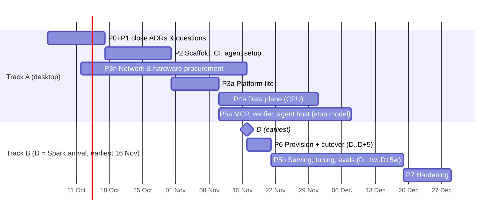

# 03 — Roadmap, Work Packages & Gates

## Planning basis (updated 2026-10-03)
- **Spark delivery (D):** not before **2026-11-15**, no guarantee. All Spark work is scheduled relative to **D**, not to calendar dates.
- **Procurement (2026-10-05):** the DGX Spark is out of stock; waiting for restock at the chosen retailer. Fallback: if it cannot be ordered by **2026-11-15**, buy an OEM system with the same GB10 chip and 128 GB (plan, ADRs and NFRs unchanged). Prices and retailer details are kept locally (`ops.local/site.md`).
- **Interim host:** Windows 11 desktop (x64), WSL2, **NVIDIA RTX 2060** (Turing, CUDA-capable, small VRAM). Too weak for real model serving or performance numbers; good enough for code, configuration, data work, small GPU tests and plumbing. Turing has no FP8/FP4, so no Spark performance can be inferred from it.
- **Principle:** the critical path to a useful system is mostly **not compute**. Everything that doesn't need the Spark's GPU or 128 GB is done before D, so cutover is a deployment, not a project.

## Two tracks

| Track | Starts | Contains | Blocked by Spark? |
|---|---|---|---|
| **A — Build now** | 2026-10-05 | P0–P2, P3n network, P3a platform-lite, P4a data plane (CPU, small universe), **P5a** intelligence-plane code against a tiny CPU model | No |
| **B — On arrival** | D | P6 cutover, **P5b** model serving + tuning + evals, P7 hardening | Yes |

*Track B bars are drawn at the earliest D. If D slips, Track B shifts as a block and Track A packages extend (see §Slip policy).*

## Interim desktop resource budget (WSL2)
Desktop (confirmed 2026-10-03; full specs in `ops.local/site.md`): 8 cores, **64 GB RAM**, NVMe + HDD + USB SSD, RTX 2060 (6 GB), 1 GbE, Windows 11.
`%USERPROFILE%\.wslconfig`: `memory=32GB`, `processors=6` (leaves 32 GB and 2 cores for Windows, VS Code and the browser).

| Component | RAM | Notes |
|---|---:|---|
| Postgres 18 + pgvector | 4 GB | `shared_buffers=1GB`; dev-universe embeddings fit in memory |
| ClickHouse | 6 GB | dev universe widened to ~100 issuers × 10 years |
| Keycloak | 1 GB | dev mode |
| Aspire dashboard + .NET services | 2 GB | |
| `grafana/otel-lgtm` all-in-one | 3 GB | can now run on the desktop (ADR-0011) |
| Small model via Ollama on the RTX 2060 (**6 GB VRAM** → ≤ 4B parameters, 4-bit, e.g. `qwen3:4b`/`qwen3:1.7b`) | 2 GB RAM + ~3 GB VRAM | **Plumbing only** — never quality evals |
| Small embedding model on the RTX 2060 (0.6B class) | VRAM | Dev universe only |
| Headroom (builds, tests, Testcontainers) | ~14 GB | |
| **Total** | **32 GB** | |

Storage layout (desktop, decided 2026-10-03):

| Drive | Type | Holds | Why |
|---|---|---|---|
| **C:** | Internal NVMe (~108 GB free after cleanup) | Docker Desktop disk (virtual disk limit 64 GB), Ubuntu WSL2 distro (sparse VHD) | Databases and builds need the fastest disk |
| **E:** | USB SSD, 1 TB | Ollama models (`OLLAMA_MODELS`), NuGet/uv caches (`NUGET_PACKAGES`, `UV_CACHE_DIR`), raw SEC downloads, Parquet/dev datasets | Fast enough for bulk data, keeps C: free |
| **D:** | Internal HDD, 2 TB | restic backup target (restore drill until the NAS exists), cold archives | Backups must sit on a different physical disk than the data |
| F: | USB drive | not used | — |

USB SSD rules: NTFS (not exFAT: no journal), fixed drive letter `E:`, USB selective suspend off, never unplug while WSL/Docker run. Weekly `just clean` (Docker prune).
Not run on the desktop: vLLM, embeddings at full scale, arm64 images on every PR (QEMU too slow → **amd64 on PR, multi-arch nightly**).
Runs on the desktop GPU, **to be verified in P2** (WSL2 GPU passthrough + RAPIDS support for Turing): Polars GPU engine for the first CPU/GPU parity test (ADR-0014), small embedding model, Ollama on GPU.
GPU rule (6 GB VRAM): **one GPU job at a time** — the test LLM, the embedding model and the Polars GPU parity test do not run together; Ollama unloads idle models (`OLLAMA_KEEP_ALIVE=5m`).
Risk: the desktop runs a preview (Insider-channel) Windows build; a Windows update can change WSL2 or GPU-driver behaviour → pin the NVIDIA driver version once it works, and note the build in the P2 runbook.

## Phases

### P0+P1 — Define & Architect *(05–16 Oct)*
- Accept/adjust ADR-0006…0014 and 0017; answer Q1–Q4; WP1.4 model shortlist + benchmark protocol written (executed at D).
- **Gate G1:** all P0 ADRs `Accepted`; open questions answered or explicitly deferred.

### P2 — Scaffold *(≈ 17 – 30 Oct)*
- WP2.1 Monorepo skeleton (`src/`, `deploy/`, `tests/`), `.gitattributes` (LF), `.editorconfig`, `justfile`
- WP2.2 .NET 10 solution: Aspire AppHost, ServiceDefaults, Directory.Packages.props (central package mgmt)
- WP2.3 Python workspace: `uv` workspace, `ruff`, `mypy --strict`, `pytest`
- WP2.4 Devcontainer (Ubuntu 24.04) matching DGX OS userland
- WP2.5 GitHub repo (public, ADR-0004), `main` ruleset (id in `ops.local/site.md`), CI on GitHub-hosted runners incl. native arm64 (`ubuntu-24.04-arm`), fork-PR approval, secret scanning + push protection, Grype, gitleaks, Dependabot, SHA-pinned actions
- WP2.6 Dev agent setup ([agent-system.md](ai/agent-system.md) §4, ADR-0016): copy/adapt Decisya `.claude/`, add `data_guard.py`, budgets, identity-tied approvals, full audit log + deny → freeze + no-interpreter lint (ADR-0019); CLAUDE.md; first issue through its own pipeline
- **Gate G2:** `just ci` green locally and in GitHub Actions; CI builds amd64 + arm64; `lint.py` + `roster.py --check` green; hook denial tests prove lanes and data guard.

### P3n — Network & hardware readiness *(12 Oct – before D)*
- WP3n.1 Router: firmware update (VLAN support), three networks (Home / AetherSpark VLAN 20 / Guest-IoT VLAN 30), firewall rules, local DNS zone `home.arpa` on the router — [runbooks/network-setup.md](runbooks/network-setup.md) (ADR-0012)
- WP3n.2 NAS ready (ADR-0013): `aetherspark-backup` on the dedicated SSD volume, rest-server container (append-only), NAS port 2 → router LAN port on VLAN 20, NAS firewall; buy two 2 TB external USB HDDs (rotating offline + off-site copy) and a UPS sized for Spark + router + NAS. **No 10 GbE switch in v1.**
- WP3n.3 Egress proxy + nftables allowlist built and tested on the desktop (same config later on the Spark)
- WP3n.4 Physical: free router LAN port and cable run to the Spark location, power, ventilation
- **Gate G3n:** the "Done when" checklists of the network and NAS runbooks are complete (incl. first backup + restore test); the egress proxy + nftables allowlist pass their tests on the desktop (WP3n.3). Outbound traffic from the AetherSpark network is allowed at router level by design (ADR-0012); the allowlist is enforced on the host.

### P3a — Platform-lite *(≈ 31 Oct – 10 Nov)*
- WP3.1 Compose base: Traefik (TLS, step-ca), Keycloak, Postgres 18 + pgvector, Redis
- WP3.2 Observability: Aspire dashboard (dev); LGTM compose profile defined, not run on PC
- WP3.3 Secrets (ADR-0010): manifest, `just secrets generate`, age-encrypted dev store, tmpfs Docker secrets in `just up`, offline recovery key created
- WP3.4 Backup: restic job + restore drill against a dev volume, target = NAS
- **Gate G3:** `just up` from clean WSL2 works; restore drill passes; OIDC login to one sample service.

### P4a — Data plane, CPU *(≈ 10 Nov – 1 Dec; continues across D)*
- WP4.1 Schema: ClickHouse bitemporal fact tables (`valid_date`, `known_date`), Postgres reference data and lineage
- WP4.2 EDGAR ingester (.NET Wolverine: SEC fair-access rate limit, declared User-Agent, retry/backoff, idempotent by accession no.)
- WP4.3 XBRL normalizer (Python/Polars, CPU): concept mapping, unit scaling, sign conventions, context dedup
- WP4.4 Validation & anomaly quarantine (NFR-DQ-04); golden-file set (≥ 30 tricky filings); quant-validator agent and G5v go live
- WP4.5 Chunking + metadata for filings/footnotes; embed the dev universe on the RTX 2060 and run an **early recall test**: `halfvec(512)` vs full-size embeddings (de-risks ADR-0007 change 1 before D)
- **Dev universe:** ~100 deliberately hard companies × 10 years (ADR-0020); full universe (numbers tier + text tier) ingested on Spark
- **Gate G4:** golden tests green; point-in-time test proves no look-ahead; CPU baseline benchmark recorded.

### P5a — Intelligence plane, build against stub *(≈ 10 Nov – 8 Dec, desktop)* — **moved forward**
Deterministic parts don't need a real model:
- WP5a.1 MCP servers (.NET, streamable HTTP): `filings`, `fundamentals`, `vector-search` (pgvector, test embeddings), `repo` (no `fetch`, ADR-0008); `fundamentals` as a fixed query-template catalogue; contracts, pagination, size caps; Keycloak scope authZ + negative tests
- WP5a.2 `policy/agents.yaml` + policy lint; agent host skeleton (Microsoft.Extensions.AI → LiteLLM → Ollama tiny model); Wolverine run records; budgets
- WP5a.3 Claims verifier (deterministic) + its tests; quarantined-reader schema validation
- WP5a.5 Agent oversight (ADR-0019): `agent-audit` stream, deny → stop run, honeytokens, `just agents-off` kill switch + test
- WP5a.4 Eval harness + golden question set + injection set written (scored at D)
- **Gate G5a:** end-to-end run completes with the tiny model (answer quality ignored); verifier BLOCKs a seeded wrong claim; scope tests deny cross-lane calls.

### P6 — Spark provisioning & cutover *(D … D+5 days)*
- WP6.1 Firmware/DGX OS updates, disk layout, Docker + NVIDIA container toolkit check
- WP6.2 Ansible host role (users, SSH keys, firewall, node-exporter, OTel collector)
- WP6.3 Join VLAN 20 (already prepared in P3n)
- WP6.4 Deploy compose stack from nightly arm64 images, restore volumes; re-run the CPU/GPU parity test on Blackwell
- WP6.5 Apply memory budget (container limits, `--gpu-memory-utilization`)
- WP6.6 Backup target cutover (ADR-0013 Amendment 2): Spark repository + credentials, remove the desktop-phase binding, restrict the backup port to the Spark, **TLS with an internal-CA certificate** (NFR-SEC-05), alert webhook to ntfy
- **Gate G6:** NFR-OPS-01/03/05 verified on Spark.

### P5b — Serving, tuning, evals *(D+1 week … D+5 weeks)*
- WP5b.1 Execute WP1.4 benchmark (vLLM vs SGLang; model shortlist incl. GLM-4.7-Flash and QwQ-32B baseline; scenarios: single resident, two models resident, swap batch — c4.md); fix ADR-0006 to Accepted
- WP5b.2 LiteLLM aliases → real models; embed + rerank at scale; full-universe ingest
- WP5b.3 Run golden + injection + look-ahead evals; tune prompts/schemas; set thresholds
- **Gate G5:** UC-02/04/05/06 pass eval thresholds with WAN egress blocked (NFR-SEC-01).

### P7 — Hardening *(after G5, ≈ 2 weeks)*
- Load test (NFR-OPS-05), endpoint auth scan, restore drill, runbooks complete, ops calendar.
- **Gate G7:** all NFRs verified → v1.0.

## Slip policy
| If D is… | Then |
|---|---|
| 16 Nov – 30 Nov | Plan as drawn. P4a/P5a finish in parallel with P6. |
| December | Track A continues: widen golden set and injection set, harden MCP authZ tests, more P3n testing. No new scope. |
| After 31 Dec | Re-plan at a checkpoint; consider pulling forward runbooks and the cutover rehearsal (restore the full stack on a clean WSL2 instance as a dress rehearsal). |
Rule: no Track B work is simulated on the desktop beyond plumbing; no performance numbers are taken from the desktop.

## Running cost estimate — PROD (monthly, recurring)
As of 2026-10-03. One-time hardware (Spark, NAS, switch, UPS, disks) not included.

| Item | Lean | Typical | Upper |
|---|---:|---:|---:|
| Price data — Sharadar | Prices full history, annual: USD 299/yr ≈ **USD 25** | same ≈ **USD 25** | Bundle full history, monthly: **USD 69** |
| Spark electricity (35 W idle / 160 W load, measured by Tom's Hardware) | 4 h load/day ≈ 41 kWh ≈ CHF 12 | 12 h load/day ≈ 71 kWh ≈ CHF 21 | 24/7 load ≈ 117 kWh ≈ CHF 34 |
| NAS — already running today for home use (no extra cost) | 0 | 0 | 0 |
| Software (all open source), GitHub public repo + GitHub-hosted CI, ntfy | 0 | 0 | 0 |
| Claude subscription (dev agents) | already paid — not incremental | | |
| **Total** | **≈ USD 25 + CHF 12** | **≈ USD 25 + CHF 21** | **≈ USD 69 + CHF 34** |

Assumptions: electricity ≈ CHF 0.29/kWh (local utility tariff 2026, derived from published savings; verify against the actual bill — details in `ops.local/site.md`); router and NAS already run 24/7 for home use, so they add no extra cost; no extra switch or firewall (ADR-0012); the 10-year Sharadar tier is **not** enough (FY2011+ needs data from 2010).

## Future initiatives (outside this roadmap)
| Initiative | Idea | Earliest start | Precondition |
|---|---|---|---|
| **Shared identity kit** (Keycloak + BFF) | Reusable packages from Decisya + AetherSpark: realm-as-code + guard tests, Testcontainers Keycloak fixture, JWT validation (ServiceDefaults extension), client-credentials token handling, BFF (cookie session, Redis ticket store, YARP forwarding, antiforgery) as an optional package, `dotnet new` template | After Decisya Phase 0 exit | Decisya identity code stable (Phase 0 exit); AetherSpark `AetherSpark.Identity` in use (second consumer). Extract from two working users, not from one |

## Definition of Done (every work package)
Code + tests + ADR/doc updated + CI green + OTel instrumented + runbook entry if operable + both VS Code and CLI paths documented side by side (ADR-0018).

## Open questions
| # | Question | Needed by |
|---|---|---|
| ~~Q1~~ | ~~Router~~ → answered 2026-10-03: existing router supports VLANs after a firmware update (ADR-0012; details in `ops.local/site.md`) | — |
| ~~Q2~~ | ~~NAS~~ → answered 2026-10-04: existing NAS, dedicated SSD volume as backup target, second port on the AetherSpark network (ADR-0013) | — |
| ~~Q3~~ | ~~Research universe~~ → answered 2026-10-03: ADR-0020 | — |
| ~~Q4~~ | ~~Market price source~~ → answered 2026-10-03: PoC on Sharadar free tier (Dow 30) + synthetic prices; PROD Sharadar Prices **full history** bought after the PoC works (first month monthly to verify delisted coverage, then annual). Provider-neutral internal price schema keyed by CIK; raw prices + corporate actions, adjustments computed in-house. Before paying: written confirmation of personal-licence eligibility (details in `ops.local/site.md`). | — |
| ~~Q5~~ | ~~Desktop specs~~ → answered 2026-10-03/04: 64 GB RAM, 8 cores, RTX 2060 **6 GB** VRAM | — |
| ~~Q6~~ | ~~Spark delivery~~ → answered: not before 2026-11-15, no guarantee | — |
