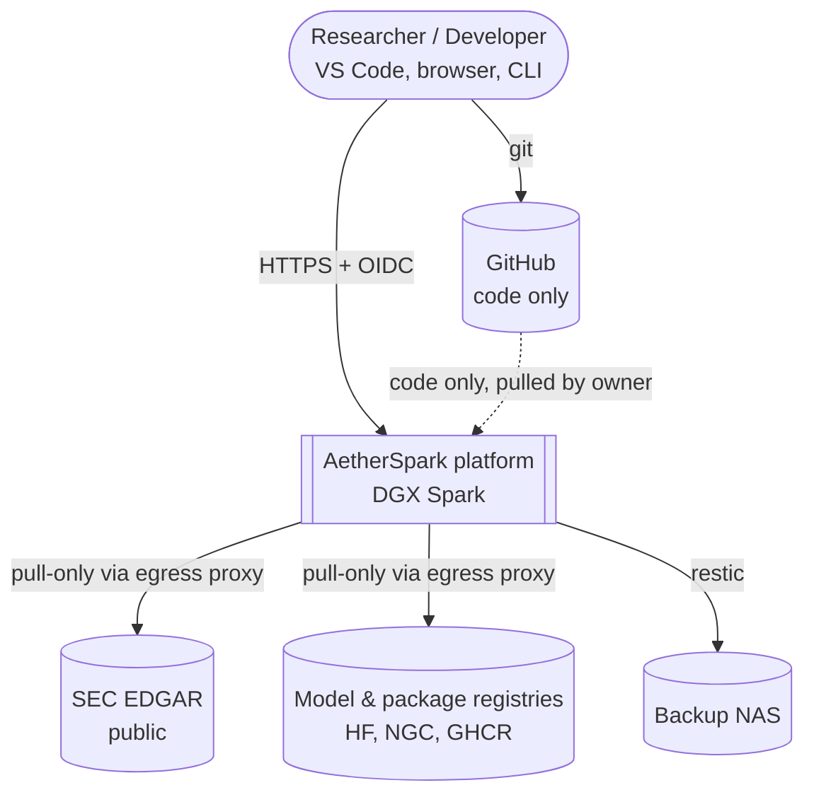

# Architecture Views (C4)

## L1 — System context

## L2 — Containers

```mermaid
flowchart LR
  subgraph Edge
    TR[Traefik<br/>TLS, routing]
    KC[Keycloak<br/>OIDC]
  end
  subgraph Intelligence
    GW[LiteLLM gateway<br/>OpenAI-compatible]
    V1[vLLM: primary LLM]
    V2[vLLM: embed + rerank]
    AG[Agent host<br/>.NET 10 + Wolverine]
    subgraph MCP[MCP servers .NET, streamable HTTP]
      M1[filings]; M2[fundamentals RO]; M3[vector-search]; M4[repo]
    end
  end
  subgraph Data
    PG[(Postgres 18<br/>+ pgvector)]
    CH[(ClickHouse)]
    RD[(Redis/Valkey<br/>optional)]
    PIPE[Pipelines<br/>Python/Polars → GPU engine]
    ING[EDGAR ingester<br/>.NET Wolverine]
  end
  subgraph Ops
    OT[OTel collector] --> LGTM[Grafana LGTM]
    RS[restic]
  end
  TR --> GW & AG & KC
  AG --> GW --> V1 & V2
  AG --> MCP
  M1 & M3 --> PG
  M2 --> CH
  ING --> PG
  ING --> PIPE --> CH & PG
  PIPE --> V2
  AG --> RD
```

## Deployment view
| Environment | Host | Runtime | What runs |
|---|---|---|---|
| dev | Windows 11 + WSL2 (Ubuntu 24.04) | Aspire AppHost (`aspire run`) / Compose profile `dev` | .NET services, Postgres, Redis, Keycloak, small CPU models via Ollama |
| prod | DGX Spark, DGX OS (Ubuntu 24.04, arm64) | Docker Compose generated by `aspire publish` + hand-maintained overlays | Full stack |
| ci | GitHub-hosted runners (amd64 + native arm64), public repo | Docker buildx | Build, test, scan; prod images built locally on the Spark from tagged commits |

## Unified-memory budget (DGX Spark, 128 GB) — initial
CPU and GPU share one pool. Every service gets a hard limit; vLLM is sized with `--gpu-memory-utilization` as a fraction of total.

| Consumer | GB | Enforcement |
|---|---:|---|
| DGX OS, system services, page-cache floor | 10 | — |
| Postgres 18 + pgvector (shared_buffers 4 GB, HNSW build headroom) | 10 | `mem_limit` |
| ClickHouse | 12 | `max_server_memory_usage` + `mem_limit` |
| Platform: Traefik, Keycloak, LiteLLM, (optional Valkey), MCP, agent host, OTel/LGTM | 8 | `mem_limit` per service |
| vLLM #2: embedder + reranker | 6 | `--gpu-memory-utilization 0.05` |
| vLLM #1: primary LLM (weights + KV cache) | 70 | `--gpu-memory-utilization ≈ 0.55` |
| Headroom (ingest bursts, Polars GPU engine) | 12 | — |
| **Total** | **128** | |

### Model shortlist (decided by WP1.4 benchmark, not by preference)
| Role | Candidates | Approx. weights | Active params/token | Mode |
|---|---|---:|---:|---|
| Interactive generalist + tools | gpt-oss-120b (MXFP4); Qwen3-30B-A3B (FP8) | ~65 GB / ~31 GB | ~5 B / ~3 B | resident |
| Coding | Qwen3-Coder-30B-A3B (FP8) | ~31 GB | ~3 B | resident or swap |
| Interactive / tools (added 2026-10-03) | GLM-4.7-Flash *(verify the model exists and its size before testing)* | tbd | tbd | resident |
| Deep reasoning (batch) | DeepSeek-R1-Distill-Llama-70B (NVFP4); Qwen3-32B; QwQ-32B *(baseline, added 2026-10-03)* | ~35–40 GB / ~20 GB / ~20 GB | dense | on-demand, swaps out resident |
| Embedding | Qwen3-Embedding-0.6B / bge-m3 | < 2 GB | — | resident |
| Reranker | Qwen3-Reranker-0.6B / bge-reranker-v2-m3 | < 2 GB | — | resident |

Full DeepSeek-R1 (671 B) does not fit and is out of scope. Only one ~65 GB model or two ~31 GB models can be resident at a time. Swap policy is defined in ADR-0006.

Speed sanity check (decode ceiling ≈ 273 GB/s ÷ bytes read per token): a dense 32B at 4-bit ≈ 10–14 tok/s; a 30B MoE with ~3B active ≈ 40–90 tok/s; a dense 70B at 4-bit ≈ 5–7 tok/s. Claims outside these ceilings are treated as wrong until measured.

Benchmark scenarios (WP1.4 / WP5b.1): (1) single resident interactive model; (2) **two models resident at once** — coder/tool model (MoE ~30B) + reasoning model (~35–40 GB at 4-bit) — measuring KV-cache room and tokens/s under the 70 GB LLM budget; (3) swap-based batch reasoning (ADR-0006).
